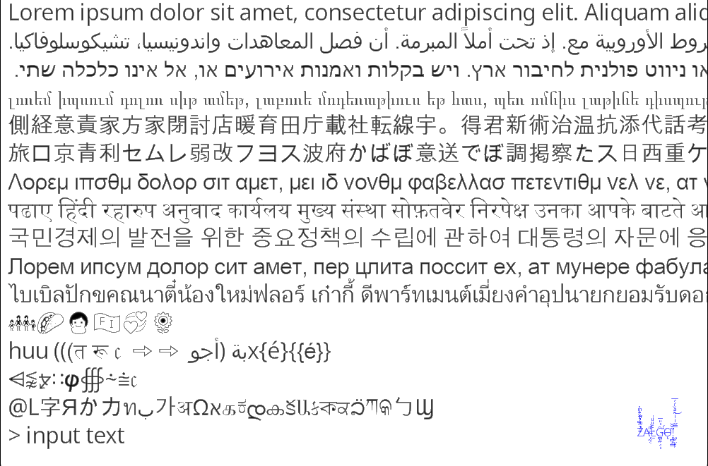

# Render unicode characters

Disclaimer: This is a prototype for a complex text layout engine. It is not production ready - see [considerations](#considerations) at the end to evaluate further steps to create such work based on this.

A complex text layout engine handles multiple writing systems, directions and fonts to render all unicode characters appropriately as part of a UI framework. This demo intends to render unicode characters with a relatively simple setup with a touch of opinionated structure and a playground to explore the dependencies involved.

Cross-platform (Windows, MacOS)

Splits strings into script and font specific runs applying them appropriately.

Based most of the rendering pipeline and some of the shaping logic on:
https://github.com/zhuyie/drawtext-gl-freetype-harfbuzz.git

# License

Note that the submodules and fonts use their own licenses. Most fonts are OFL or common creative, but do check them. This repo uses AGPL which is the most restrictive I found. I've intended this for learning purposes, not copying as is to closed source commercial solutions.

# Dependencies

- freetype2
- harfbuzz
- sheenbidi
- utfcpp
- opengl
- glfw
- glad
- glm
- ghc/filesystem (mac)

# Running from scratch

    git clone --recurse-submodules https://github.com/d3rp/font-front.git
    cmake -GNinja -Bbuild .
    cmake --build build

# Considerations

- A shared global pointer and synchronization should be implemented as well as in some cases with multiple writers/readers splitting the get_or_create into read and write separately. The code paths lead mostly to reads in real life run time, thus the aforementioned synchronization will bottleneck if the read locks are not explicit.
- Writing direction for text input and mouse gestures is another number in itself. It could be handled as a structure holding offset points of the characters. Note that Harfbuzz will switch the characters around so that all characters are sorted left to right independent of their writing direction.
- In most OSes textures can not be shared as in this Atlas. This complicates both the bin packer and texture pre-empting.
- Prebaked binary for the Atlas (for for example ascii characters) probably is quite useful for production. Easiest step is to write an export function and let the atlas get watered/populated before exporting to binary. The offset positions in Atlas and binpacker have to be exported with the pixel data.
